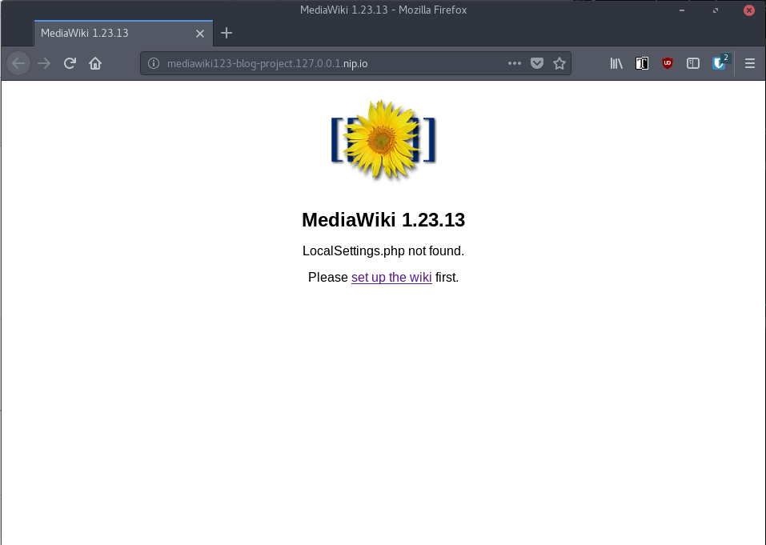
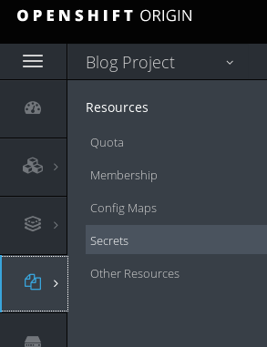
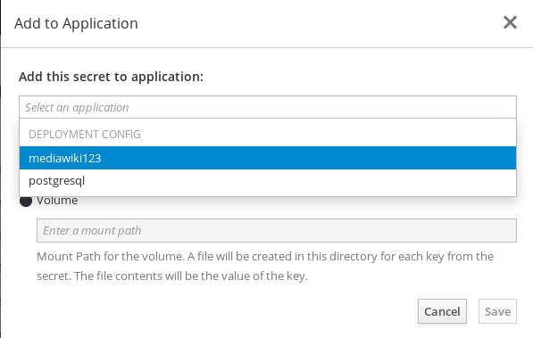
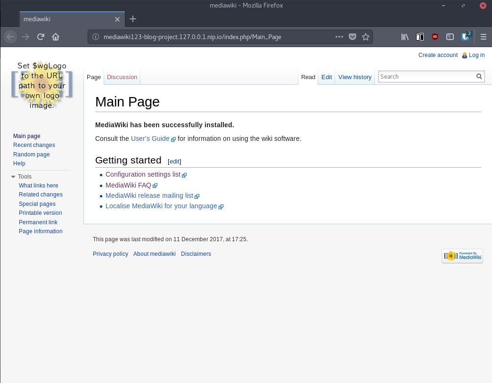

# Up and Running with the OpenShift Ansible Broker

## Overview

In OpenShift 3.7, we introduced two new concepts: Service Catalog and Service Brokers.
The Service Catalog is a self-service marketplace where service consumers can find
and acquire services. It’s also a place for various service providers to list their
services to consumers. _(For more detailed information about Service Catalog
check out Paul Morie's [Service Catalog deep dive](https://blog.openshift.com/openshift-commons-briefing-106-service-catalog-on-openshift-3-7-deep-dive/))_

To be useful to service consumers, the Service Catalog needs to be populated with
content. This content is made available to the Service Catalog through Brokers,
which implement the [Open Service Broker API](https://github.com/openservicebrokerapi/servicebroker) (OSB API). The broker is responsible for informing the Service Catalog of the
services it can provision.

Brokers may be responsible for only a single service, for example, a MySQL
broker, or they may offer a specific type of facility, like the [OpenShift
Template broker](https://docs.openshift.com/container-platform/3.7/architecture/service_catalog/template_service_broker.html) that supports a collection of services based on templates.
Finally, brokers may be generic and a bit more powerful like the [OpenShift
Ansible Broker](https://github.com/openshift/ansible-service-broker/), which
exposes services based on the Ansible Playbook Bundle
(APB) application definition.

APBs provide a new method for defining and distributing simple to complex
multi-container services on OpenShift, consisting of a bundle of Ansible
Playbooks built into a container image with an Ansible runtime. APBs leverage
Ansible automation to create a standard mechanism for automating complex deployments. _(For
more detailed information about Ansible Playbook Bundles check out the [OpenShift Commons](https://blog.openshift.com/openshift-commons-briefing-74-deploying-multi-container-applications-ansible-service-broker/)
briefing by Todd Sanders and John Matthews.)_

Now that you know what the OpenShift Ansible Broker is, let's get one up and
running.

## Setup
As with most applications, there are a variety of ways to setup the broker. This can be done
using templates, Makefile targets, or from the OpenShift installer. For this blog, we will
focus on using a simple OpenShift template to launch the broker.

You will need an OpenShift Container Platform 3.7 cluster running with the Service Catalog enabled.
Typically, I just start a cluster with the following command:

```bash
oc cluster up --service-catalog=true
```

Once the cluster is running, we can install the OpenShift Ansible Broker onto the
cluster and register it with the Service Catalog. First, we will need a new
project to run the broker in. Using the CLI, let's create the
`ansible-service-broker` project.

```bash
oc login -u system:admin
oc new-project ansible-service-broker
```

After a successful run, you'll see something like this:

```bash
Now using project "ansible-service-broker" on server "https://127.0.0.1:8443".

You can add applications to this project with the 'new-app' command. For example, try:

    oc new-app centos/ruby-22-centos7~https://github.com/openshift/ruby-ex.git

to build a new example application in Ruby.
```

With the project created, we can now deploy the broker. We've assembled an
OpenShift [template](https://raw.githubusercontent.com/jmrodri/simple-asb/up-and-running/deploy-ansible-service-broker.template.yaml)
that can be used for this purpose. Let's download the template, process the variables, and create an OpenShift Ansible Broker instance.

~~~bash
curl -s https://raw.githubusercontent.com/jmrodri/simple-asb/up-and-running/simple-broker-template.yaml | oc process -n "ansible-service-broker" -f - | oc create -f -
~~~

A successful deployment will look like this:

```bash
service "asb" created
service "asb-etcd" created
serviceaccount "asb" created
clusterrolebinding "asb" created
clusterrole "asb-auth" created
clusterrolebinding "asb-auth-bind" created
clusterrole "access-asb-role" created
persistentvolumeclaim "etcd" created
deploymentconfig "asb" created
deploymentconfig "asb-etcd" created
secret "asb-auth-secret" created
secret "registry-auth-secret" created
configmap "broker-config" created
serviceaccount "ansibleservicebroker-client" created
clusterrolebinding "ansibleservicebroker-client" created
secret "ansibleservicebroker-client" created
route "asb-1338" created
clusterservicebroker "ansible-service-broker" created
```

We now have an OpenShift cluster with the Service Catalog and Ansible Broker
running. You can communicate with the Broker through the Service Catalog
using the oc command line. Here is an example of listing all the available
APB service classes:

~~~bash
oc get clusterserviceclasses --all-namespaces -o custom-columns=NAME:.metadata.name,DISPLAYNAME:spec.externalMetadata.displayName | grep APB
~~~

It may take some time for the broker to sync the APBs into the catalog. If you
get no APBs at first, run it again in a few seconds. Once they are available we
can start provisioning services.

## Provisioning Services

As mentioned above, the Broker implements the Open Service Broker API. This API
contains some key verbs: provision, bind, and others. Provision will typically deploy a
service in your cluster. In the case of the OpenShift Ansible Broker, it provisions
a service using the Ansible Playbook Bundle meta-container and invoking the
provision playbook.

For our service provisioning example, we're going to walkthrough provisioning
MediaWiki which is backed by a PostgreSQL database. This is accomplished by
first provisioning a PostgreSQL instance and then the MediaWiki service.

Once the two services have been provisioned, we will tie them together by creating
a binding between them. Bind is another one of the OSB API verbs used to provide
credentials/coordinates for specific services. Like the provision operation, the
Broker uses the PostgreSQL APB meta-container and invokes the bind playbook to
create the binding.

Let's recap, first, we will provision two services using APBs: PostgreSQL and
MediaWiki. Next we create and consume the binding to the PostgreSQL database instance.
Finally, we will verify the MediaWiki service is up and running.

## Provision PostgreSQL
Using the PostgreSQL APB, we're going to provision a PostgreSQL database
instance to use with MediaWiki service.

1. We need to visit the console UI at https://127.0.0.1:8443, after accepting the
certificate, you should see the login screen:


2. Login with `admin:admin`. You should see a list of services, some marked
with APB after the service name:


3. From the list of services, select the **PostgreSQL (APB)**. You will be prompted for some
information as you proceed with provisioning the service.


4. Next step is to choose a plan. For this deployment, you can just select the **'Development'** plan.


5. The configuration screen will ask you for some information. Create a new project named
*blog-project* fill in the display name of *Blog Project*. Finally, enter a password for the
database instance. It is fine to keep the other values as defaults.


To summarize, we selected the PostgreSQL APB to provision a PostgreSQL database service instance.
We created a new project to deploy the service to. We supplied some configuration parameters for
the service. These parameters are actually supplied by the PostgreSQL APB. It's part of the
service's metadata which is exposed to OpenShift. This allows the UI to be catered for a given
service. We will see a different set of parameters when we provision the
MediaWiki service later on.

One concept you may have noticed during the provisioning operation was the notion of service
plans. Service plans are another OSB API concept that is akin to tiers or pricing plans. For
example, you could have a development plan that provides minimal resources, lower cost, and
little to no persistence storage. This would let users use a service for development purposes
at a lower price. Or you could have, for example, a production plan, that has high-availability,
a good amount of persistence storage, and more resources. The PostgreSQL APB exposes
two service plans: development and production.

## Create the Binding
A binding is a link between two service instances. To save time, we'll create a binding
while provisioning the PostgreSQL service instance. This will save
the credentials for the PostgreSQL database into a secret that can be shared with
other services.


While the PostgreSQL APB provisions the database service instance, we can move on to
provisioning MediaWiki.


## Provision MediaWiki
Using the MediaWiki APB, we're going to proceed with provisioning the MediaWiki
service.

1. Start by selecting **'MediaWiki (APB)'** from the Service Catalog.


2. In the *Add to Project* drop-down select the *Blog Project*
that we created earlier. Also, enter in passwords. _(Note: You can not use
*admin* for the password as the service instance will not startup.)_


3. If we look in the *Blog Project* project, we can see the MediaWiki service
deploying, and the PostgreSQL service should now be deployed.


4. Once MediaWiki has provisioned, we can open the URL in a web browser to connect
to the service. You should see the default start page. Take note of the error message as
the service is not setup yet as we still need to bind MediaWiki to the
PostgreSQL database.



## Consume Binding
With the PostgreSQL database and the MediaWiki services provisioned, we can now
bind them. Since we created a binding during the provision phase for PostgreSQL,
all we need to do is add this binding to the MediaWiki service.

1. Navigate to the Secrets menu of the *Blog Project* project.



2. Select the `dh-postgresql-apb-*-credentials-*` secret. Click the **Add to
   Application button**


3. From the Add to Application modal, select **mediawiki123** from the list. And
   choose **Environment variables**.



4. Adding the secret to the MediaWiki environment will cause the application to
   be redeployed automatically.


5. We took the PostgreSQL binding and added it to the MediaWiki service instance.
When the MediaWiki service redeployed it consumed the environment variables
to know what database instance to connect to. If we revisit the MediaWiki web
page again, we'll see that it's pu and now fully configured.



### List the Services from the CLI
The Service Catalog UI isn't the only way to interact with the Broker. We can also list the
provisioned services using the CLI.

```bash
$ oc get serviceinstances --all-namespaces
NAMESPACE      NAME                      AGE
blog-project   dh-mediawiki-apb-rhzcs    1m
blog-project   dh-postgresql-apb-t84wc   7m
```

Let's check out the secrets in the *'blog-project'*

~~~bash
$ oc get secrets -n blog-project | awk -F, 'BEGIN{IGNORECASE=1}; NR==1 {print $1}; /^dh/ {print $1}'
NAME                                        TYPE                                  DATA      AGE
dh-mediawiki-apb-parametersch7a5            Opaque                                1         22m
dh-postgresql-apb-parameters43rfr           Opaque                                1         28m
dh-postgresql-apb-t84wc-credentials-x9xd8   Opaque                                6         27m
~~~

To reiterate, we brought up an OpenShift Container Platform 3.7 cluster, deployed the OpenShift Ansible Broker,
listed and provisioned a couple of services using APBs to perform the task.

## Come Check out Openshift Ansible Broker
If you would like to know more about the OpenShift Ansible Broker I encourage
you to check out the project at: [https://github.com/openshift/ansible-service-broker/](https://github.com/openshift/ansible-service-broker/)

Also consider subscribing to:

* IRC: Freenode #asbroker
* Mailing list: [https://www.redhat.com/mailman/listinfo/ansible-service-broker](https://www.redhat.com/mailman/listinfo/ansible-service-broker)
* Github: [https://github.com/openshift/ansible-service-broker/](https://github.com/openshift/ansible-service-broker/)
* YouTube: [ansible-service-broker](https://www.youtube.com/channel/UC04eOMIMiV06_RSZPb4OOBw)
