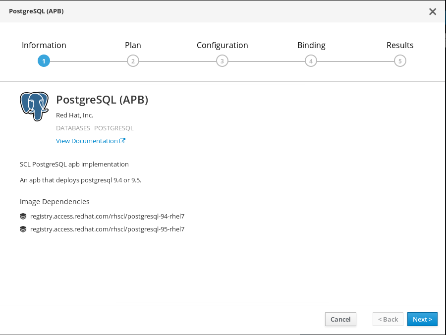
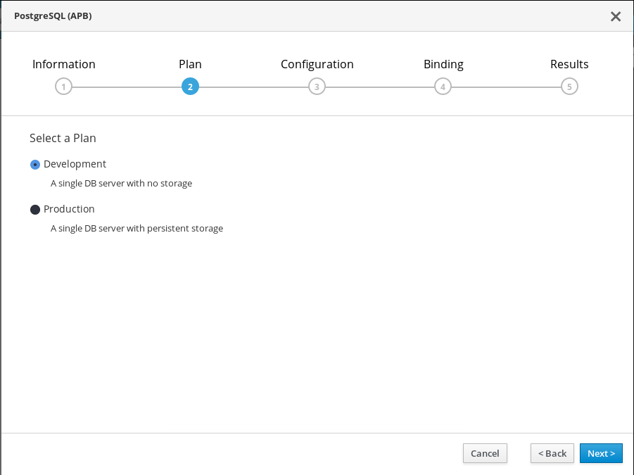
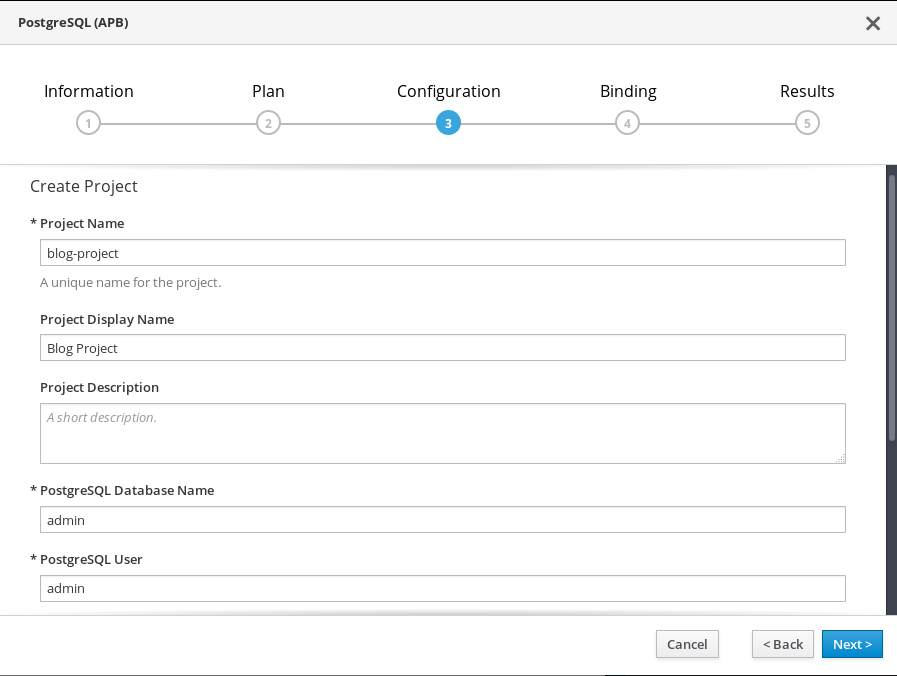
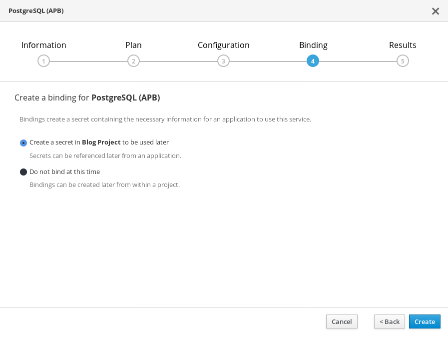
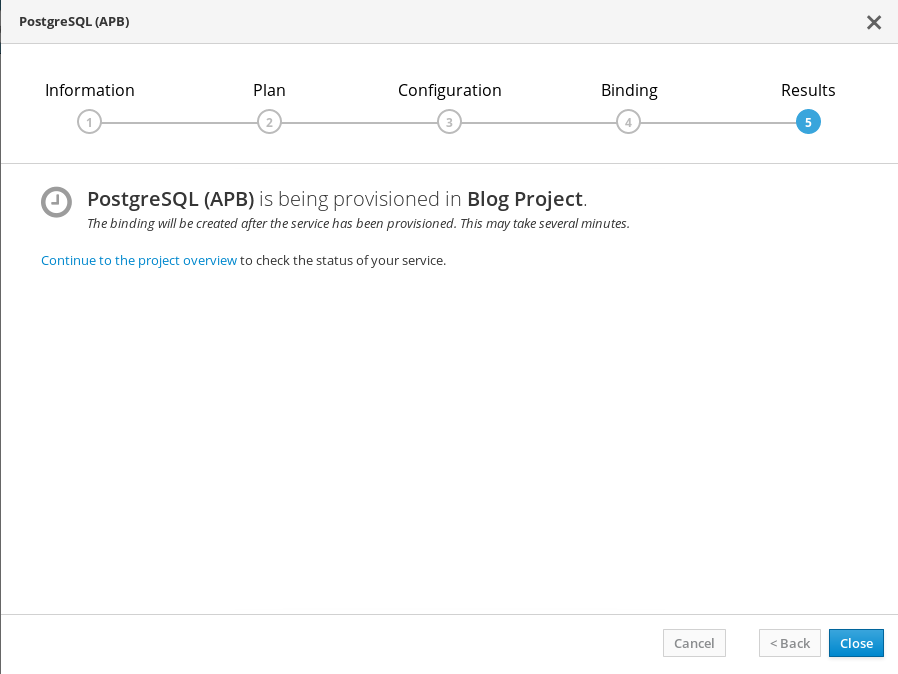
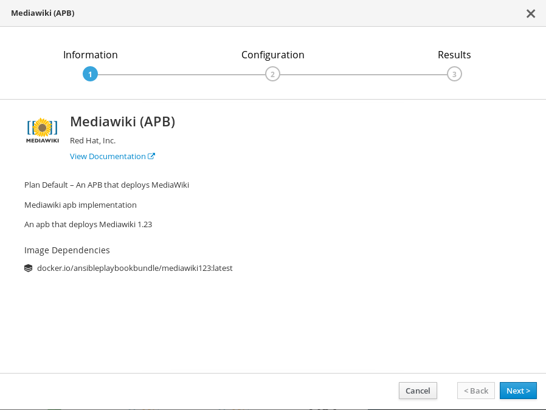
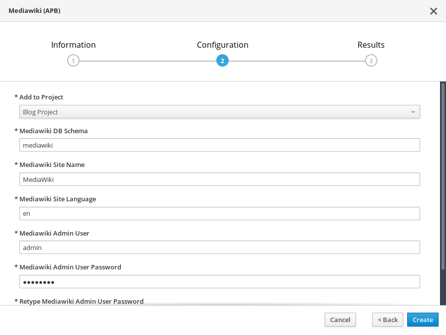
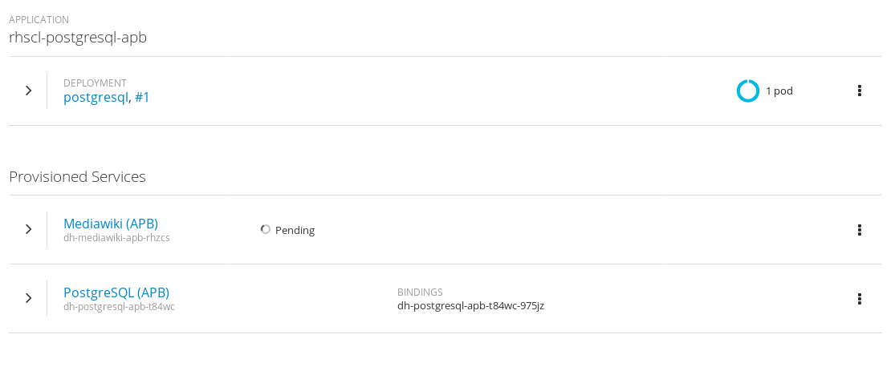
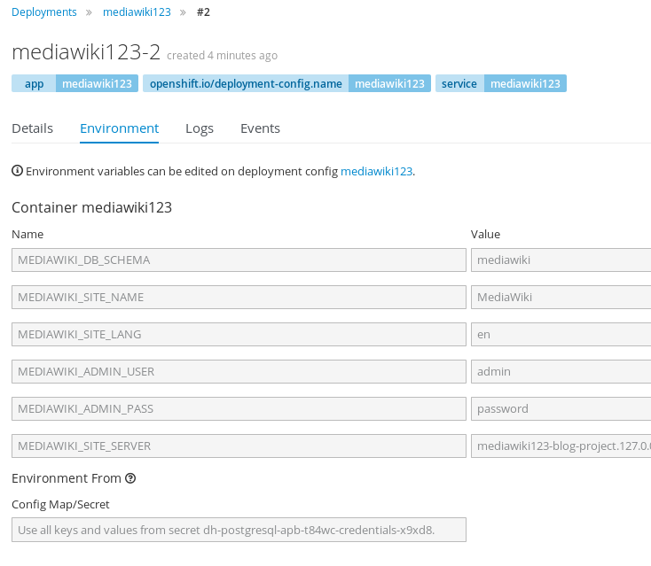

# DRAFT
# Up and running with the Ansible Service Broker

## Setup
In this blog we will discuss how to get up and running with the OpenShift
Ansible broker. What is the Ansible broker you ask?

> The OpenShift Ansible broker (OAB) is an implementation of the Open Service
> Broker (OSB) API that manages applications defined by Ansible playbook bundles
> (APBs). APBs provide a new method for defining and distributing container
> applications in OpenShift Origin, consisting of a bundle of Ansible playbooks
> built into a container image with an Ansible runtime. APBs leverage Ansible to
> create a standard mechanism for automating complex deployments.

There are a variety of ways of setting up the broker from templates to Makefile
targets to the OpenShift installer. For the purpose of this blog post we will
focus on using a simple OpenShift template to launch the broker.

You will need an OpenShift 3.7 cluster running with the service catalog enabled.
[INSERT LINK TO HOW TO DO THAT].  I typically just start a cluster with the
following command:

```bash
oc cluster up --service-catalog=true
```

NOTE: if you are using Fedora 26 ensure you are using docker-1.13.1-44 or newer:
https://bugzilla.redhat.com/show_bug.cgi?id=1504709

Once the cluster is running, we can install the OpenShift Ansible broker into the
cluster and register it with the service catalog. First, we will need a new
project to run the broker in. Using the CLI let's create the
`ansible-service-broker` project.

```bash
oc login -u system:admin
oc new-project ansible-service-broker
```

After a succesful run, you'll see something like this:

```bash
Now using project "ansible-service-broker" on server "https://127.0.0.1:8443".

You can add applications to this project with the 'new-app' command. For example, try:

    oc new-app centos/ruby-22-centos7~https://github.com/openshift/ruby-ex.git

to build a new example application in Ruby.
```

With the project now created, we can deploy the broker. We've assembled an
OpenShift [template](https://raw.githubusercontent.com/jmrodri/simple-asb/up-and-running/deploy-ansible-service-broker.template.yaml)
that can be used. In order to use this template we need to get the CA certificate
to use for the broker.

```bash
VARS="-p BROKER_CA_CERT=$(oc get secret -n kube-service-catalog -o go-template='{{ range .items }}{{ if eq .type "kubernetes.io/service-account-token" }}{{ index .data "service-ca.crt" }}{{end}}{{"\n"}}{{end}}' | tail -n 1)"
```

The certificate parameter is now stored. Now let's download the template, process the variables, and create the broker.

```bash
curl -s https://raw.githubusercontent.com/jmrodri/simple-asb/up-and-running/deploy-ansible-service-broker.template.yaml | oc process -n "ansible-service-broker" $VARS -f - | oc create -f -
```

A succesful deployment will look like the following.

```bash
service "asb" created
service "asb-etcd" created
serviceaccount "asb" created
clusterrolebinding "asb" created
clusterrole "asb-auth" created
clusterrolebinding "asb-auth-bind" created
clusterrole "access-asb-role" created
persistentvolumeclaim "etcd" created
deploymentconfig "asb" created
deploymentconfig "asb-etcd" created
secret "asb-auth-secret" created
secret "registry-auth-secret" created
configmap "broker-config" created
serviceaccount "ansibleservicebroker-client" created
clusterrolebinding "ansibleservicebroker-client" created
secret "ansibleservicebroker-client" created
route "asb-1338" created
clusterservicebroker "ansible-service-broker" created
```

Okay, we have an OpenShift cluster with a Service Catalog and Ansible broker
running.  You can communicate with the broker through the service catalog
using the oc command line. Here is an example of listing out the available
APB service classes:

```bash
oc get clusterserviceclasses --all-namespaces -o custom-columns=NAME:.metadata.name,DISPLAYNAME:spec.externalMetadata.displayName | grep APB
```

It may take some time for the broker to sync the APBs into the catalog. If you
get no APBs at first, run it again in a few seconds. Once they are availble we
can provision one.

## Provision an APB
We will now provision a PostgreSQL APB, create a binding, and provision a
MediaWiki APB. Visit the console UI at https://127.0.0.1:8443, after accepting the
certificate, you should see the login screen:


Login with admin:admin. You should see a list of APB services:


Select the PostgreSQL APB, follow the prompts. Create a new project called
blog-project, Blog Project.



Select the Development plan.



Enter in a password, keep the other values as defaults is fine.



Let's create a binding. This will save the credentials for the PostgreSQL DB
into a secret that can be shared with other applications.





Next, let's provision the MediaWiki application.



Configure MediaWiki



We can see it deploying, and that PostgreSQL has already been deployed.




### List the services from the CLI
The UI isn't the only way to interact with the broker. We can list the
provisioned services using the CLI..

```bash
$ oc get serviceinstances --all-namespaces
NAMESPACE      NAME                      AGE
blog-project   dh-mediawiki-apb-rhzcs    1m
blog-project   dh-postgresql-apb-t84wc   7m
```

Let's checkout the secrets in the blog-project
```bash
$ oc get secrets -n blog-project | awk -F, 'BEGIN{IGNORECASE=1}; NR==1 {print $1}; /^dh/ {print $1}'
NAME                                        TYPE                                  DATA      AGE
dh-mediawiki-apb-parametersch7a5            Opaque                                1         22m
dh-postgresql-apb-parameters43rfr           Opaque                                1         28m
dh-postgresql-apb-t84wc-credentials-x9xd8   Opaque                                6         27m
```

So what have we done? We brought up a 3.7 cluster, deployed the Ansible broker,
listed and provisioned an APBs.

### APB authors
If you are an APB developer, you will likely want to have access to the
OpenShift local registry. You can enable the internal registry to allow
your APBs be pushed to the internal registry for faster development.
Just add an entry to the [registry config entry](https://github.com/openshift/ansible-service-broker/blob/master/docs/config.md#openshift-registry):

```yaml
registry:
  # ... other registry entries
  - type: local_openshift
    name: lo
    namespaces:
      - openshift
    white_list:
      - ".*-apb$"
```

### Deployment Template
Below you will find the template used to deploy the broker.

```yaml
apiVersion: v1
kind: Template
metadata:
  name: ansible-service-broker
objects:
- apiVersion: v1
  kind: Service
  metadata:
    name: asb
    labels:
      app: ansible-service-broker
      service: asb
    annotations:
      service.alpha.openshift.io/serving-cert-secret-name: asb-tls
  spec:
    ports:
      - name: port-1338
        port: 1338
        targetPort: 1338
        protocol: TCP
    selector:
      app: ansible-service-broker
      service: asb

- apiVersion: v1
  kind: Service
  metadata:
    name: asb-etcd
    labels:
      app: etcd
      service: asb-etcd
  spec:
    ports:
      - name: port-2379
        port: 2379
        targetPort: 2379
        protocol: TCP
    selector:
      app: etcd
      service: asb-etcd

- apiVersion: v1
  kind: ServiceAccount
  metadata:
    name: asb
    namespace: ansible-service-broker

- apiVersion: rbac.authorization.k8s.io/v1beta1
  kind: ClusterRoleBinding
  metadata:
    name: asb
  roleRef:
    name: admin
    kind: ClusterRole
    apiGroup: rbac.authorization.k8s.io
  subjects:
  - kind: ServiceAccount
    name: asb
    namespace: ansible-service-broker

- apiVersion: rbac.authorization.k8s.io/v1beta1
  kind: ClusterRole
  metadata:
    name: asb-auth
  rules:
  - apiGroups: [""]
    resources: ["namespaces"]
    verbs: ["create", "delete"]
  - apiGroups: ["authorization.openshift.io"]
    resources: ["subjectrulesreview"]
    verbs: ["create"]
  - apiGroups: ["authorization.k8s.io"]
    resources: ["subjectaccessreviews"]
    verbs: ["create"]
  - apiGroups: ["authentication.k8s.io"]
    resources: ["tokenreviews"]
    verbs: ["create"]

- apiVersion: rbac.authorization.k8s.io/v1beta1
  kind: ClusterRoleBinding
  metadata:
    name: asb-auth-bind
  subjects:
  - kind: ServiceAccount
    name: asb
    namespace: ansible-service-broker
  roleRef:
    kind: ClusterRole
    name: asb-auth
    apiGroup: rbac.authorization.k8s.io

- apiVersion: rbac.authorization.k8s.io/v1beta1
  kind: ClusterRole
  metadata:
    name: access-asb-role
  rules:
  - nonResourceURLs: ["${BROKER_URL_PREFIX}", "${BROKER_URL_PREFIX}/*"]
    verbs: ["get", "post", "put", "patch", "delete"]

- apiVersion: v1
  kind: PersistentVolumeClaim
  metadata:
    name: etcd
    namespace: ansible-service-broker
  spec:
    accessModes:
      - ReadWriteOnce
    resources:
      requests:
        storage: 1Gi

- apiVersion: v1
  kind: DeploymentConfig
  metadata:
    name: asb
    labels:
      app: ansible-service-broker
      service: asb
  spec:
    replicas: 1
    selector:
      app: ansible-service-broker
    strategy:
      type: Rolling
    template:
      metadata:
        labels:
          app: ansible-service-broker
          service: asb
      spec:
        serviceAccount: asb
        containers:
        - image: ansibleplaybookbundle/origin-ansible-service-broker:latest
          name: asb
          imagePullPolicy: IfNotPresent
          volumeMounts:
            - name: config-volume
              mountPath: /etc/ansible-service-broker
            - name: asb-tls
              mountPath: /etc/tls/private
            - name: asb-auth-volume
              mountPath: /var/run/asb-auth
          ports:
            - containerPort: 1338
              protocol: TCP
          env:
          - name: BROKER_CONFIG
            value: ${BROKER_CONFIG}
          resources: {}
          terminationMessagePath: /tmp/termination-log
          readinessProbe:
            httpGet:
              path: /healthz
              port: 1338
              scheme: HTTPS
            initialDelaySeconds: 15
            timeoutSeconds: 1
          livenessProbe:
            httpGet:
              port: 1338
              path: /healthz
              scheme: HTTPS
            initialDelaySeconds: 15
            timeoutSeconds: 1
        volumes:
          - name: config-volume
            configMap:
              name: broker-config
              items:
              - key: broker-config
                path: config.yaml
          - name: asb-tls
            secret:
              secretName: asb-tls
          - name: asb-auth-volume
            secret:
              secretName: asb-auth-secret

- apiVersion: v1
  kind: DeploymentConfig
  metadata:
    name: asb-etcd
    labels:
      app: etcd
      service: asb-etcd
  spec:
    replicas: 1
    selector:
      app: etcd
    strategy:
      type: Rolling
    template:
      metadata:
        labels:
          app: etcd
          service: asb-etcd
      spec:
        serviceAccount: asb
        containers:
        - image: ${ETCD_IMAGE}
          name: etcd
          volumeMounts:
            - name: etcd
              mountPath: /data
          imagePullPolicy: IfNotPresent
          terminationMessagePath: /tmp/termination-log
          workingDir: /etcd
          args:
            - ${ETCD_PATH}
            - --data-dir=/data
            - --listen-client-urls=http://0.0.0.0:2379
            - --advertise-client-urls=http://0.0.0.0:2379
          ports:
            - containerPort: 2379
              protocol: TCP
          env:
          - name: ETCDCTL_API
            value: "3"
        volumes:
          - name: etcd
            persistentVolumeClaim:
              claimName: etcd

- apiVersion: v1
  kind: Secret
  metadata:
    name: asb-auth-secret
    namespace: ansible-service-broker
  data:
    username: ${BROKER_USER}
    password: ${BROKER_PASS}

- apiVersion: v1
  kind: Secret
  metadata:
    name: ${REGISTRY_SECRET_NAME}
    namespace: ansible-service-broker
  data:
    username: ${DOCKERHUB_USER}
    password: ${DOCKERHUB_PASS}

- apiVersion: v1
  kind: ConfigMap
  metadata:
    name: broker-config
    namespace: ansible-service-broker
    labels:
      app: ansible-service-broker
  data:
    broker-config: |
      registry:
        - type: "dockerhub"
          name: "dh"
          url: "https://registry.hub.docker.com"
          org: "ansibleplaybookbundle"
          tag: "${TAG}"
          white_list:
            - ".*-apb$"
      dao:
        etcd_host: asb-etcd.ansible-service-broker.svc
        etcd_port: 2379
      log:
        logfile: /var/log/ansible-service-broker/asb.log
        stdout: true
        level: debug
        color: true
      openshift:
        host: "${CLUSTER_AUTH_HOST}"
        ca_file: "${CA_FILE}"
        bearer_token_file: "${BEARER_TOKEN_FILE}"
        image_pull_policy: "${IMAGE_PULL_POLICY}"
        sandbox_role: "${SANDBOX_ROLE}"
        keep_namespace: ${KEEP_NAMESPACE}
        keep_namespace_on_error: ${KEEP_NAMESPACE_ON_ERROR}
      broker:
        dev_broker: ${DEV_BROKER}
        bootstrap_on_startup: ${BOOTSTRAP_ON_STARTUP}
        refresh_interval: "${REFRESH_INTERVAL}"
        launch_apb_on_bind: ${LAUNCH_APB_ON_BIND}
        output_request: ${OUTPUT_REQUEST}
        recovery: ${RECOVERY}
        ssl_cert_key: /etc/tls/private/tls.key
        ssl_cert: /etc/tls/private/tls.crt
        auto_escalate: ${AUTO_ESCALATE}
        auth:
          - type: basic
            enabled: false

- apiVersion: v1
  kind: ServiceAccount
  metadata:
    name: ansibleservicebroker-client
    namespace: ansible-service-broker

- apiVersion: rbac.authorization.k8s.io/v1beta1
  kind: ClusterRoleBinding
  metadata:
    name: ansibleservicebroker-client
  subjects:
  - kind: ServiceAccount
    name: ansibleservicebroker-client
    namespace: ansible-service-broker
  roleRef:
    kind: ClusterRole
    name: access-asb-role
    apiGroup: rbac.authorization.k8s.io

- apiVersion: v1
  kind: Secret
  metadata:
    name: ansibleservicebroker-client
    annotations:
      kubernetes.io/service-account.name: ansibleservicebroker-client
  type: kubernetes.io/service-account-token

- apiVersion: v1
  kind: Route
  metadata:
    name: asb-1338
    labels:
      app: ansible-service-broker
      service: asb
  spec:
    to:
      kind: Service
      name: asb
    port:
      targetPort: port-1338
    tls:
      termination: reencrypt

- apiVersion: ${SVC_CAT_API_VER}
  kind: ${BROKER_KIND}
  metadata:
    name: ansible-service-broker
  spec:
    url: https://asb.ansible-service-broker.svc:1338${BROKER_URL_PREFIX}/
    authInfo:
      ${{BROKER_AUTH}}
    caBundle: ${BROKER_CA_CERT}

parameters:
- description: Service Catalog API Version.  Newer service-catalogs use servicecatalog.k8s.io/v1beta1
  displayname: Service Catalog API Version.  Newer service-catalogs use servicecatalog.k8s.io/v1beta1
  name: SVC_CAT_API_VER
  value: servicecatalog.k8s.io/v1beta1

- description: Service Broker kind. Newer service-catalogs use ClusterServiceBroker
  displayname: Service Broker kind. Newer service-catalogs use ClusterServiceBroker
  name: BROKER_KIND
  value: ClusterServiceBroker

- description: Service Broker CA Cert.
  displayname: Service Broker kind.
  name: BROKER_CA_CERT
  value: ""

- description: Service Broker url prefix for the cluster
  displayname: ASB Url Prefix
  name: BROKER_URL_PREFIX
  value: "/ansible-service-broker"

- description: Broker Auth Info
  displayname: Broker Auth Info
  name: BROKER_AUTH
  value: '{ "bearer": { "secretRef": { "kind": "Secret", "namespace": "ansible-service-broker", "name": "ansibleservicebroker-client" } } }'

- description: Suffix for OpenShift routes
  displayname: Suffix for OpenShift routes
  name: ROUTING_SUFFIX
  value: "172.17.0.1.nip.io"

- description: Container Image to use for etcd in format of imagename:tag
  displayname: etcd Image
  name: ETCD_IMAGE
  value: quay.io/coreos/etcd:latest

- description: Path of the etcd binary
  displayname: etcd path
  name: ETCD_PATH
  value: /usr/local/bin/etcd

- description: Configuration filepath for Ansible Service Broker
  displayname: Ansible Service Broker Configuration File
  name: BROKER_CONFIG
  value: /etc/ansible-service-broker/config.yaml

- description: APB Image Tag
  displayname: APB Image Tag
  name: TAG
  value: latest

- description: OpenShift User Password
  displayname: OpenShift User Password
  name: OPENSHIFT_PASS
  value: admin

- description: OpenShift User Name
  displayname: OpenShift User Name
  name: OPENSHIFT_USER
  value: admin

- description: OpenShift Target URL
  displayname: OpenShift Target URL
  name: OPENSHIFT_TARGET
  value: kubernetes.default

- description: Registry Secret Name
  displayname: Registry Secret Name
  name: REGISTRY_SECRET_NAME
  value: registry-auth-secret

- description: Registry Auth Type
  displayname: Registry Auth Type
  name: REGISTRY_AUTH_TYPE
  value: secret

- description: Include Broker Development Endpoint
  displayname: Include Broker Development Endpoint
  name: DEV_BROKER
  value: "true"

- description: Launch APB on bind
  displayname: Launch APB on bind
  name: LAUNCH_APB_ON_BIND
  value: "false"

- description: Will automatically bootstrap the broker on startup
  displayname: Bootstrap On Startup
  name: BOOTSTRAP_ON_STARTUP
  value: "true"

- description: Refresh the available broker images every interval of seconds
  displayname: Refresh Interval
  name: REFRESH_INTERVAL
  value: "600s"

- description: Output broker requests to log
  displayname: Output broker requests to log
  name: OUTPUT_REQUEST
  value: "true"

- description: Recover unfinshed jobs on restart
  displayname: Recovery
  name: RECOVERY
  value: "true"

- description: Auto escalate the broker. Will remove user impresonation
  displayname: Auto Escalate
  name: AUTO_ESCALATE
  value: "false"

- description: APB ImagePullPolicy
  displayname: APB ImagePullPolicy
  name: IMAGE_PULL_POLICY
  value: "IfNotPresent"

############################################################
# NOTE: These values MUST be base64 encoded.
# http://red.ht/2wbrCYo states "The value associated with
# keys in the data map must be base64 encoded."
############################################################
- description: Broker user password
  displayname: Broker user password
  name: BROKER_PASS
  value: YWRtaW4=

- description: Broker user name
  displayname: Broker user name
  name: BROKER_USER
  value: YWRtaW4=

- description: Dockerhub user password
  displayname: Dockerhub user password
  name: DOCKERHUB_PASS
  value: ""

- description: Dockerhub user name
  displayname: Dockerhub user name
  name: DOCKERHUB_USER
  value: ""

############################################################
# NOTE: Default behavior for these are going to use the kubernetes
# InClusterConfig. These are typically overridden for running
# the broker outside of a cluster. Under normal circumstances,
# you probably want to leave these blank.
############################################################
- description: Service Account CAFile Path
  displayname: Service Account CAFile Path
  name: CA_FILE
  value: ""

- description: Service Account Bearer Token File
  displayname: Service Account Bearer Token File
  name: BEARER_TOKEN_FILE
  value: ""

- description: Cluster Authentication Host
  displayname: Cluster Authentication Host
  name: CLUSTER_AUTH_HOST
  value: ""

- description: Role to use for APB Sandboxes
  displayname: Role to use for APB Sandboxes
  name: SANDBOX_ROLE
  value: "edit"

- description: Always keep the namespace after an APB is executed.
  displayname: Always keep the namespace after an APB is executed.
  name: KEEP_NAMESPACE
  value: "false"

- description: Always keep the namespace after an APB is executed and has errored.
  displayname: Always keep the namespace after an APB is executed and has errored.
  name: KEEP_NAMESPACE_ON_ERROR
  value: "true"
############################################################
```
